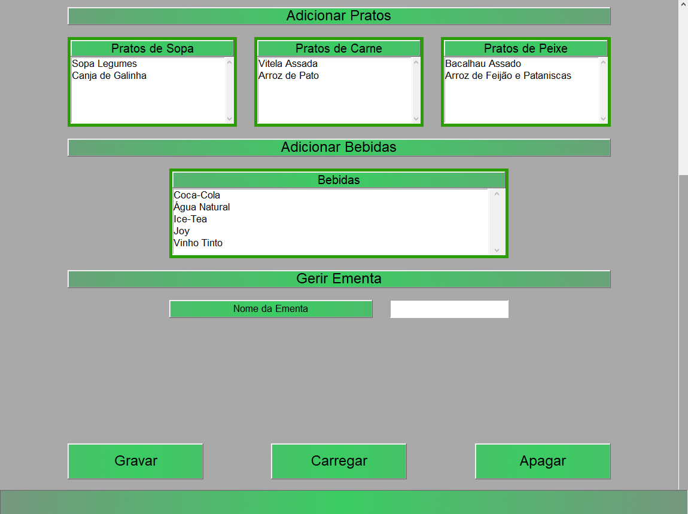

# CateringWare
Projeto baseado numa ideia depois de trabalhar no ramo de Catering.\
Permite gerir informações de eventos de Catering e gerar relatórios com base nessa informação.

## Estado
Em desenvolvimento.

## Funcionalidades
- Gestão de Pessoal, Produtos, Menus e Serviços Catering
- Criação de relatório de preços, material de trabalho e produtos do serviço

## Futuras Funcionalidades
- Gestão de Serviços criados por formulário de @amber-lab/TascaDaRosaWeb

## Futuras Atualizações
- Melhoria de GUI
- Melhoria de performance de inicialização
- Melhoria dos estilos dos relatórios
- Correções ortográficas

## Tecnologias
- Python
	- Tkinter
- Sqlite3

## Informação de executavél
Todas as classes estão na raiz do repositório, a diretoria "cat-py-module" contém as mesmas classes e é usada para a compilação do software em executavél usando cx_Freeze com o script "setup.py", esta diretoria é movida para os modulos raiz de python onde a biblioteca cx_Freeze irá fazer uma procura automática.\
Para correr a aplicação no interpretador Python é necessário usar o ficheiro principal "CateringWare.py" e mover o ficheiro de inicialização localizado em "cat-py-module" para a diretoria "lib\cat" da instalação Python.

### Uso
A configuração inicial de CateringWare é fundamental para o uso do software, este baseia-se em informações pre inseridas como Pessoal, Produtos e Menus. Só depois desta configuração é que será possível usar todas as funções do software. Foi adotado o nome "Tasca da Rosa" como empresa fictícia.\
CateringWare é composto por um menu de temas onde será feita cada configuração.\
\
Como página inicial é apresentada uma página com futuros serviços com o nome do serviço e respetivas datas.\
\
Para haver serviços nesta página é necessário a configuração do Pessoal, Produtos e Menus, para depois poder criar Serviços.

#### Página do Pessoal
A página do pessoal é dividida em duas partes, "Criar novo Trabalhador" e "Gerir Trabalhador".\
"Criar Novo Trabalhador" é composto por três entradas de dados acerca do trabalhador, nome, custo e tipo de trabalhador.\
"Gerir Trabalhador" é composto por uma entrada de dados onde insere o nome de qual trabalhador pretende alterar informações ou apagar dados.\
Esta página tem três butões, "Gravar", "Carregar" e "Apagar". O butão "Gravar" irá alterar as informações carregadas ou inseridas do novo trabalhador, o butão "Carregar" irá procurar um ou uma lista de trabalhadores de acordo com o nome inserido em "Nome de trabalhador" na secção "Gerir Trabalhador", o butão "Apagar" remove um trabalhador carregado pelo butão "Carregar" que terá as suas informações apresentadas nas entradas de dados na secção "Criar Novo Trabalhador".\
\
Esta pagina contém uma Barra de Estado por baixo dos butões que mostra mensagens de acordo com as alterações feita ou possíveis erros.\
\
Para Carregar um trabalhador é necessário preencher o "Nome de Trabalhador" na secção "Gerir Trabalhador", quando clicar no butão carregar será apresentada uma lista de trablhadores e deve haver um duplo clique no nome do trabalhador à escolha, se não preencher este campo serão carregados todos os trabalhadores.\

#### Página de Produtos
A página de produtos é dividida em duas partes, "Criar Novo Produto" e "Gerir Produto".\
"Criar Novo Produto" é composto de quatro entradas de dados comuns a todos os produtos, Nome, Custo para empresa, Preço de venda e tipo de Produto, o custo do produto para a empresa deve ser calculado internamente pela empresa. Caso seja uma bebida será apresentado novas entradas de dados acerca da bebida como "Litros por unidade" e uma opção de seleção caso seja uma bebida branca, esta opção é fundamental pois não é consumido a mesma quantidade de bebida branca como de àgua, vinho ou refrigerante. Caso seja um sobremesa ou entrada deve ser escolhido entre a opção "Unitário" para produtos que dão apenas para uma pessoa ou "Divisivél" para produtos que dão para várias pessoas, caso seja "Dívisivel" é necessário dar a informação de quantas divisões podem ser feitas com esse produto, esta informação é importante para calcular o numero de produtos necessários para uma certa quantidade de pessoas.\
"Gerir Produto" é composto por uma entrada de dados onde insere o nome de qual produto que pretende alterar informações ou apagar dados.\
Esta página tem três butões, "Gravar", "Carregar" e "Apagar". O butão "Gravar" irá alterar as informações carregadas ou inseridas do novo Produto, o butão "Carregar" irá procurar um ou uma lista de produtos de acordo com o nome inserido em "Nome de Produto" na secção "Gerir Produtos", o butão "Apagar" remove um produto carregado pelo butão "Carregar" que terá as suas informações apresentadas nas entradas de dados na secção "Criar Novo Produto".\
\
A Barra de Estado e o funcionamento do butão "Carregar" são similares à da página de trabalhadores.

#### Página Menus

Esta página é constituida por um submenu que difere vários tipos de menus, o uso delas é bastante semelhante e só será apresentada uma delas.\
\
De acordo com o tipo de menu que deseja criar deve escolher uma das opções apresentadas. Esta página é constituida por por varias secções dependendo do tipo de menu, neste caso iremos apresentar o menu de refeição que é dos mais extenso.\
\
\
Na primerira secção "Criar novo menu" é necessário informar o nome que terá o menu na entrada de dados "Nome do menu". A segunda secção corresponde aos "Produtos do Menu" que inicialmente estará vazia, os items apresentados na secção "Adicionar Pratos" e "Adicionar Bebidas" são baseados no tipo de menu, neste caso menu de refeição, caso fosse um menu de sobremesas apenas seriam apresentadas sobremesas.\
Para adicionar produtos à secção "Produtos do menu" é necessário um clique duplo nos produtos apresentados nas secções seguintes à secção "Produtos do Menu", eles serão automaticamente separados de acordo com o tipo de produto. O butão "Limpar" irá limpar todas as seleções feitas.\
A seguinte imagem mostra um menu preenchido com nome e produtos inseridos, note a diferença.\
\
A Barra de Estado e o funcionamento do butão "Carregar", "Gravar" e "Apagar" são similares às outras páginas.
