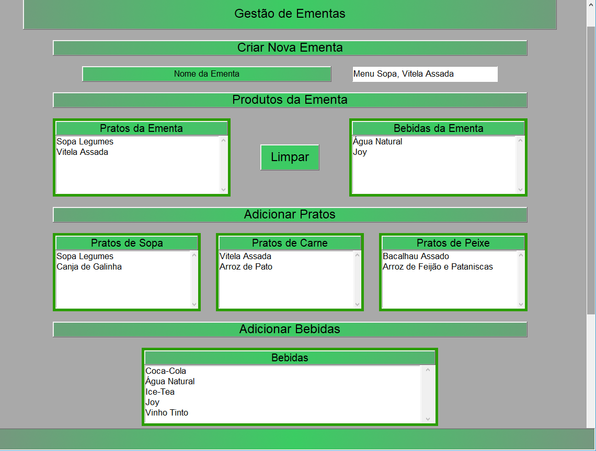
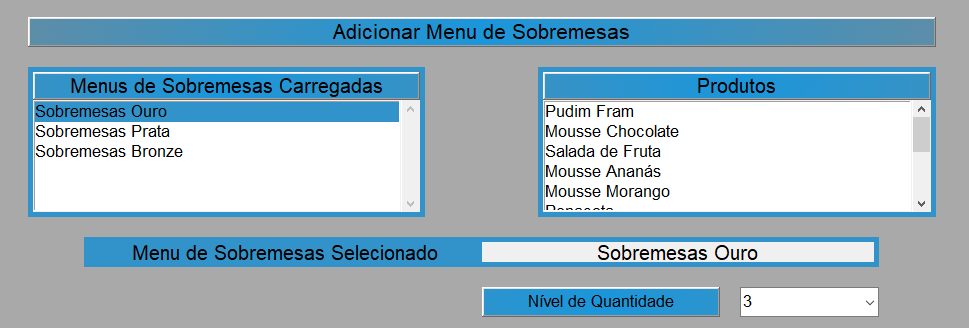
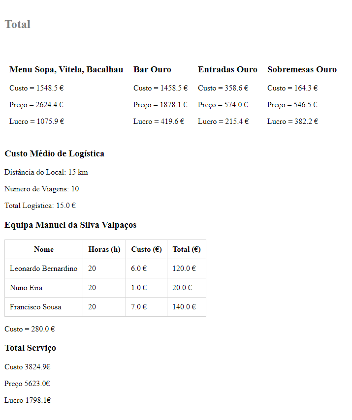

# CateringWare
Este projeto foi baseado numa ideia depois de trabalhar no ramo de Catering.\
Permite gerir informações de eventos de Catering e gerar relatórios com base nessa informação.

# Estado
Em desenvolvimento.

# Funcionalidades
- Gestão de Pessoal, Produtos, Menus e Serviços Catering
- Criação de relatório de preços, material de trabalho e produtos do serviço

# Futuras Atualizações
- Gestão de Serviços criados por formulário de [@amber-lab/TascaDaRosaWeb](https://github.com/amber-lab/TascaDaRosaWeb)
- Lista de serviços carregados devem ser apenas serviços de estado aberto
- Melhoria de GUI
- Melhoria de performance de inicialização
- Melhoria dos estilos dos relatórios
- Correções ortográficas

# Tecnologias
- Python3
	- Tkinter
- Sqlite3

# Informação de executável
Todas as classes estão na raiz do repositório, o diretório "cat-py-module" contém as mesmas classes e é usada para a compilação do software em executável usando "cx_Freeze" com o script "setup.py", este diretório é movido para os módulos built-in de python onde a biblioteca cx_Freeze irá fazer uma procura automática. Para criar o ficheiro init de "cat-py-module" irá ser criada uma função.\
Para correr a aplicação no interpretador Python é necessário usar o ficheiro principal de "CateringWare.py" e mover o ficheiro de inicialização localizado em "cat-py-module" para o diretório "lib\cat" da instalação Python, ou então usar "CateringWareDebug.py" para usar as classes na raiz do diretório.
Para iniciar compilação, navegar até raiz do software e executar "python setup.py build".

# Informação de Classes

- Database(SQLite3)
	- Database file
		- CateringDB.db
	- Database Manager
		- CateringDBManager.py
- Back-end
	- CateringErrors.py
	- Cateringitens.py
	- CateringProduct.py
	- CateringService.py
	- CateringSet.py
	- CateringWare.py
	- HTMLWriter.py
	- setup.py
- Front-end
	- Páginas
		- CateringAppetizersPage.py
		- CateringBarPage.py
		- CateringDessertsPage.py
		- CateringHomePage.py
		- CateringMenuPage.py
		- CateringPageSetsMenu.py
		- CateringProductPage.py
		- CateringWorker.py
		- CateringServicePage.py
		- CateringWorkerPage.py
	- Widgets
		- CateringPage.py
		- CateringPageInfoLabel.py
		- CateringPageLabeledDateEntry.py
		- CateringPageLabeledEntry.py
		- CateringPageMenuButton.py
		- CateringPageMenuFrame.py
		- CateringPagePopUpMensage.py
		- CateringPageScrollBarFrame.py
		- CateringPageScrollBarList.py
		- CateringPageTable.py
		- CateringPageTitleLabel.py

CateringPage.py faz parte de uma próxima atualização de lógica de programação. Irá atuar como classe abstrata das páginas para melhoria do código. 

## Uso
A configuração inicial de CateringWare é fundamental para o uso do software, este baseia-se em informações pré inseridas como Pessoal, Produtos e Menus. Só depois desta configuração é que será possível usar todas as funções do software. Foi adotado o nome "Tasca da Rosa" como empresa fictícia.\
CateringWare é composto por um menu de temas onde será feita cada configuração.

Como página inicial é apresentada uma página com futuros serviços com o nome do serviço e respetivas datas.

Para haver serviços nesta página é necessário a configuração do Pessoal, Produtos e Menus, para depois poder criar Serviços.

### Página do Pessoal
A página do pessoal é dividida em duas partes, "Criar novo Trabalhador" e "Gerir Trabalhador".\
"Criar Novo Trabalhador" é composto por três entradas de dados acerca do trabalhador, nome, custo e tipo de trabalhador.\
"Gerir Trabalhador" é composto por uma entrada de dados onde insere o nome de qual trabalhador pretende alterar informações ou apagar dados.\
Esta página tem três botões, "Gravar", "Carregar" e "Apagar". O botão "Gravar" irá alterar as informações carregadas ou inseridas do novo trabalhador, o botão "Carregar" irá procurar um ou uma lista de trabalhadores de acordo com o nome inserido em "Nome de trabalhador" na secção "Gerir Trabalhador", o botão "Apagar" remove um trabalhador carregado pelo botão "Carregar" que terá as suas informações apresentadas nas entradas de dados na secção "Criar Novo Trabalhador".

Esta página contém uma Barra de Estado por baixo dos botões que mostra mensagens de acordo com as alterações feitas ou possíveis erros.

Para Carregar um trabalhador é necessário preencher o "Nome de Trabalhador" na secção "Gerir Trabalhador", quando clicar no botão carregar será apresentada uma lista de trabalhadores e deve haver um duplo clique no nome do trabalhador à escolha, se não preencher este campo serão carregados todos os trabalhadores.

### Página de Produtos
A página de produtos é dividida em duas partes, "Criar Novo Produto" e "Gerir Produto".\
"Criar Novo Produto" é composto por quatro entradas de dados comuns a todos os produtos, Nome, Custo para empresa, Preço de venda e tipo de Produto, o custo do produto para a empresa deve ser calculado internamente pela empresa. Caso seja uma bebida será apresentado novas entradas de dados acerca da bebida como "Litros por unidade" e uma opção de seleção caso seja uma bebida branca, esta opção é fundamental pois não é consumido a mesma quantidade de bebida branca como de àgua, vinho ou refrigerante. Caso seja uma sobremesa ou entrada deve ser escolhido entre a opção "Unitário" para produtos que dão apenas para uma pessoa ou "Divisível" para produtos que dão para várias pessoas, caso seja "Divisível" é necessário dar a informação de quantas divisões podem ser feitas com esse produto, esta informação é importante para calcular o número de produtos necessários para uma certa quantidade de pessoas.\
"Gerir Produto" é composto por uma entrada de dados onde insere o nome de qual produto pretende alterar informações ou apagar dados.\
Esta página tem três botões, "Gravar", "Carregar" e "Apagar". O botão "Gravar" irá alterar as informações carregadas ou inseridas do novo Produto, o botão "Carregar" irá procurar um ou uma lista de produtos de acordo com o nome inserido em "Nome de Produto" na secção "Gerir Produtos", o botão "Apagar" remove um produto carregado pelo botão "Carregar" que terá as suas informações apresentadas nas entradas de dados na secção "Criar Novo Produto".

A Barra de Estado e o funcionamento do botão "Carregar" são similares à da página de trabalhadores.

### Página Menus

Esta página é constituída por um submenu que difere vários tipos de menus, o uso delas é bastante semelhante e só será apresentada uma delas.

De acordo com o tipo de menu que deseja criar deve escolher uma das opções apresentadas. Esta página é constituída por por várias secções dependendo do tipo de menu, neste caso iremos apresentar o menu de refeição que é dos mais extensos.

Na primeira secção "Criar novo menu" é necessário informar o nome que terá o menu na entrada de dados "Nome do menu". A segunda secção corresponde aos "Produtos do Menu" que inicialmente estará vazia, os itens apresentados na secção "Adicionar Pratos" e "Adicionar Bebidas" são baseados no tipo de menu, neste caso menu de refeição. Na hipótese de ser um menu de sobremesas apenas seriam apresentadas sobremesas.\
Para adicionar produtos à secção "Produtos do menu" é necessário um clique duplo nos produtos apresentados nas secções seguintes à secção "Produtos do Menu", eles serão automaticamente separados de acordo com o tipo de produto. O botão "Limpar" irá limpar todas as seleções feitas.\
A seguinte imagem mostra um menu preenchido com nome e produtos inseridos, note a diferença.

A Barra de Estado e o funcionamento do botão "Carregar", "Gravar" e "Apagar" são similares às outras páginas.

### Página Serviços

Esta página é utilizada para a criação dos serviços de Catering, nela será possivel inserir Menus e Trabalhadores préviamente criados. Inicialmente a página terá as entradas de dados vazias ou com informações sugestivas. 

Esta pagina contém duas Barras de Estado com uma a informar o serviço em uso com o nome de "Objeto em uso", localizada no topo da página, e outra que informará alterações e possíveis erros, localizada no fundo da página.

A página de Serviços é dividida em 9 secções:
1. Criar Novo Serviço
	- Nome do Serviço
	- Data de Realização
	- Número de Pessoas
	- Número de copos por Pessoa
	- Estado do Serviço
	- Local do Serviço
	- Distância do Serviço
	- Número de viagens 

2. Adicionar Menu de Refeições
	- Lista de Menus préviamente criados com nome de "Menus de Refeição carregados"
		- Clique no item para escolher
	- Lista de produtos do menu escolhido com nome de "Produtos"
	- Barra de Estado "Menu Selecionado" de maneira a informar a escolha.

3. Adicionar Bar
	- Lista de Bares préviamente criados com nome de "Bares carregados"
		- Clique no item para escolher
	- Lista de produtos do Bar escolhido com nome de "Produtos"
	- Barra de Estado "Bar Selecionado" de maneira a informar escolha.

4. Adicionar Menu de Entradas
	- Lista de Menus de Entradas préviamente criados com nome de "Menus de Entradas carregados"
		- Clique no item para escolher
	- Lista de produtos do Menu de Entradas escolhido com nome de "Produtos"
	- Barra de Estado "Menu de Entradas Selecionado" de maneira a informar escolha.
	- Escolha múltipla "Nível de quantidade" que irá aumentar número de produtos de acordo com nível

5. Adicionar Menu de Sobremesas
	- Lista de Menus de Sobremesas préviamente criados com nome de "Menus de Sobremesas carregados"
		- Clique no item para escolher
	- Lista de produtos do Menu de Sobremesas escolhido com nome de "Produtos"
	- Barra de Estado "Menu de Sobremesas Selecionado" de maneira a informar a escolha.
	- Escolha múltipla "Nível de quantidade" que irá aumentar número de produtos de acordo com nível

6. Gestão da Equipa
	- Lista de trabalhadores com todos os trabalhadores préviamente criados com nome de "Adicionar Trabalhadores"
		- Duplo clique no trabalhador á escolha para adicionar á "Tabela de Trabalhadores do Serviço"
	- Tabela de Trabalhadores do Serviço
		- Nome do Trabalhador
			- Corresponde a todos os Trabalhadores adicionados na lista "Adicionar Trabalhadores"
			- Duplo clique para remover da lista
			- Clique para selecionar um ou mais trabalhadores
		- Horas de serviço
			- Número de horas adicionadas pelo botão adicionar
		- Botão adicionar
			- Adiciona número de horas aos trabalhadores selecionados de acordo com as inseridas em "Número de horas"

7. Material de Montagem
	- Tipo de Mesa
		- Redonda ou Retangular
		- Influencia número de mesas necessárias
	- Mesas extra
		- Corresponde ao número de mesas extra para a funcionalidade do serviço
		- Mesas Retângulares

8. Resultados Finais
	- Montagem
		Criação de relatório acerca de número de itens necessários para o funcionamento do serviço.
	- Valores
		Criação de relatório acerca de valores gastos e estimativa de retorno de valores baseados nos produtos necessários
	- Produtos
		Corresponde ao número de produtos necessários de acordo com os menus e niveis de quantidade assinalados

#### Exemplo de Relatórios
Páginas serão geradas no Ambiente de Trabalho dentro do diretório "Inventários Catering\\{Nome do serviço}\\{Nome da página}"
##### Montagem

##### Valores

##### Produtos

9. Gerir Serviço
	- Entrada de dados
		- Nome do serviço a carregar ou apagar
	- Botões
		- Gravar
			- Grava alterações feitas num novo serviço ou num serviço carregado pelo botão "Carregar"
		- Carregar
			- Carrega uma lista de Serviços baseado na Entrada de dados "Nome do Serviço"
				- Duplo clique no serviço a escolha para carregar informações
		- Apagar
			- Remove Serviço após confirmação do usuário
